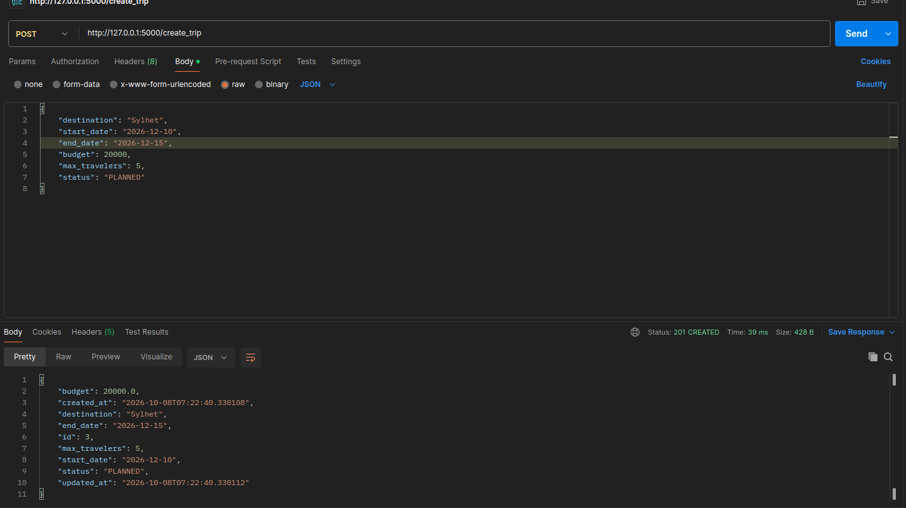
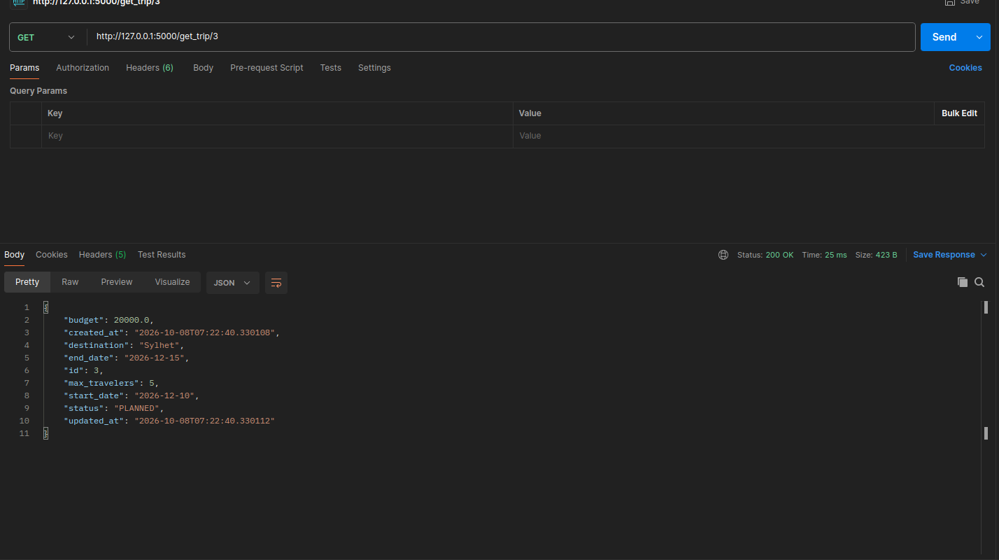
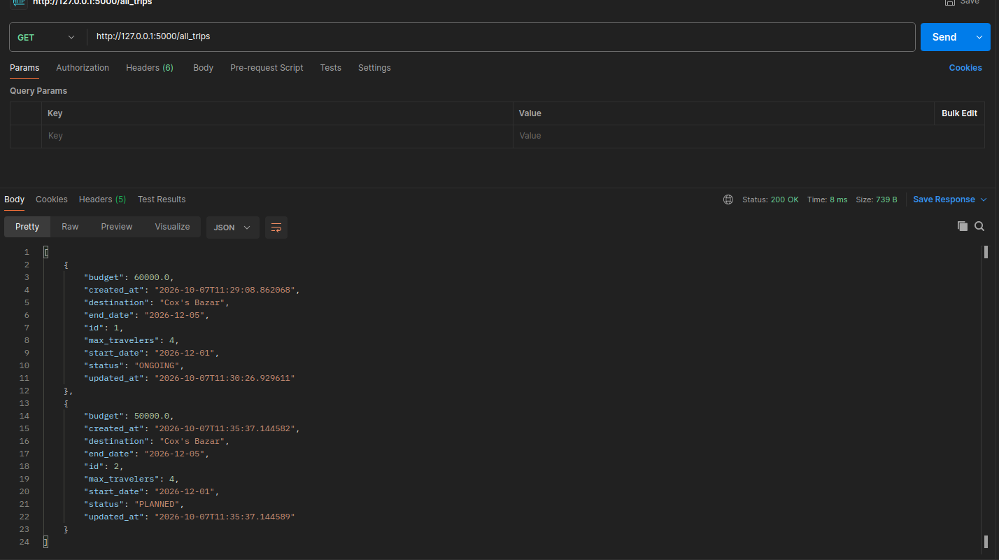
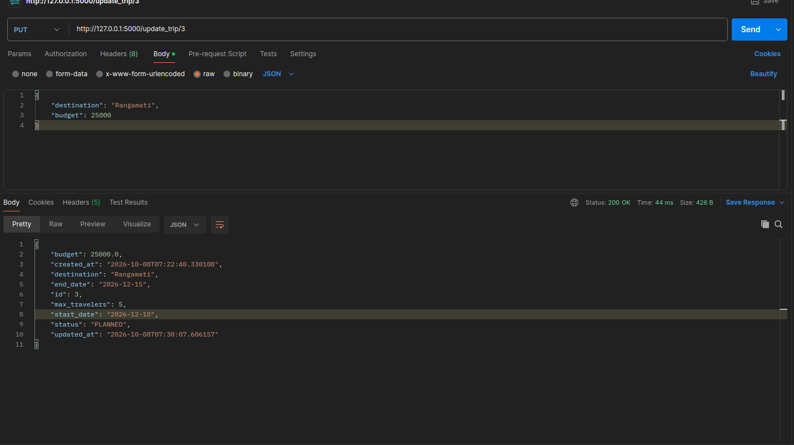
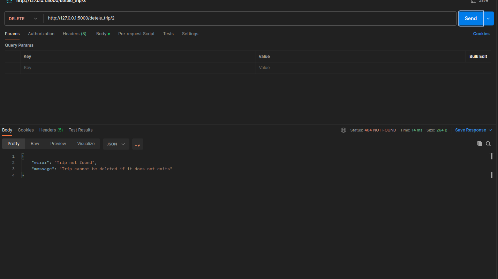
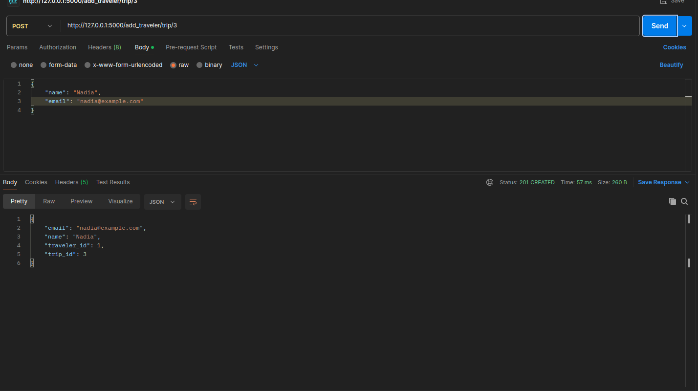
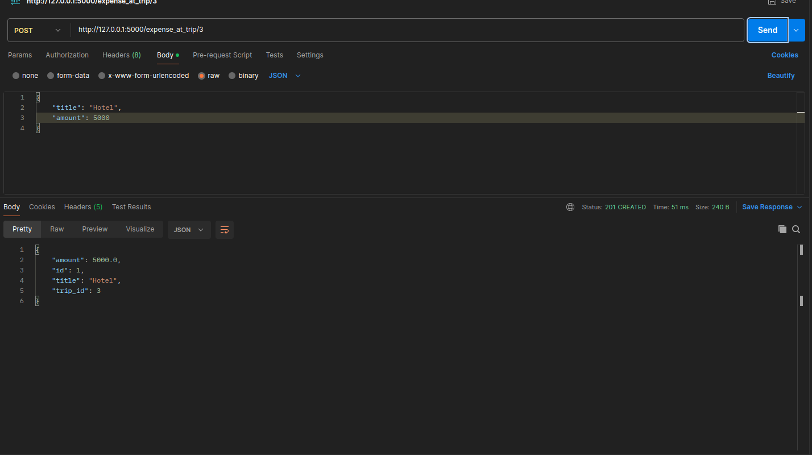
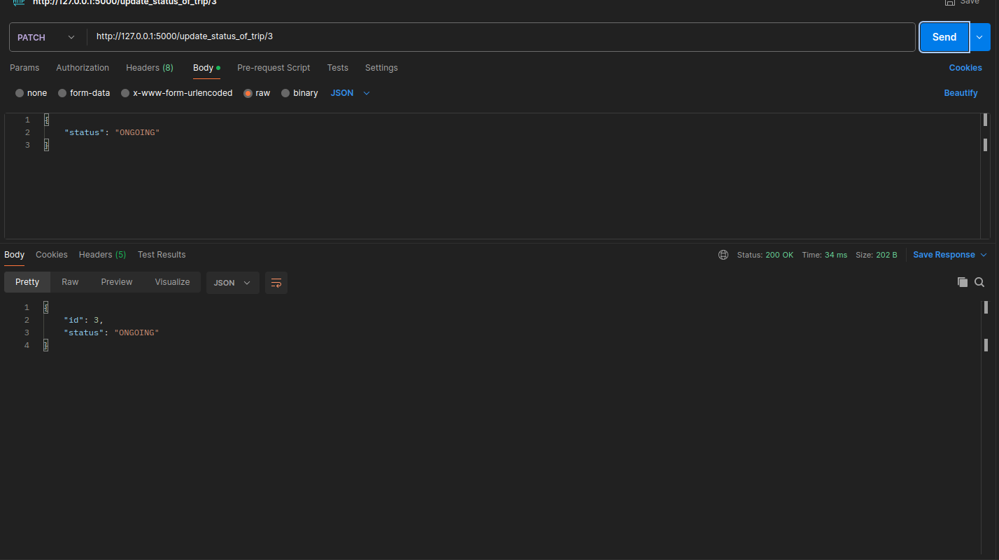
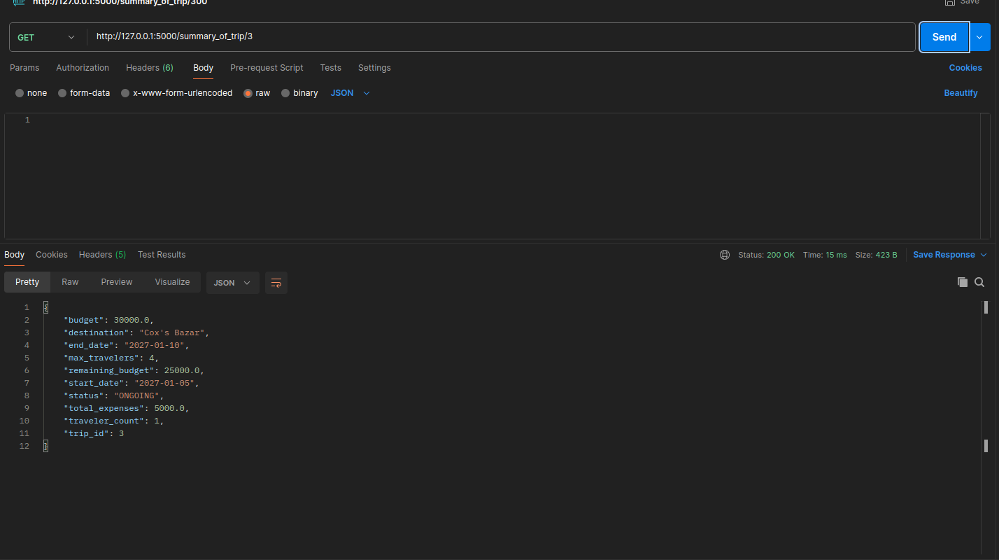

# Trip Planner API

A RESTful backend built with **Flask** and **SQLite** for creating, viewing, updating and deleting trip plans.

---

## 1. Project Overview and Problem Statement

**Trip Planner API** solves this by providing a simple backend service where a client can:

- Create a trip with destination, dates, budget and traveller limit
- List all trips and fetch a single trip
- Update or delete an existing trip
- Track the trip `status` (e.g. `PLANNED`, `ONGOING`, `COMPLETED`, `CANCELLED`)


---

## 2. Prerequisites

- Python **3.10+**
- `pip`
- Git
- Bash-compatible terminal (Linux / macOS / Git Bash or WSL on Windows)

---

## 3. Fresh-Clone Run Instructions (using `./run.sh`)

```bash
# 1. Clone the repository
git clone <https://github.com/NadiaAmir-90/nadia_amir_trip_planner_batch_12>
cd nadia_amir_trip_planner_batch_12

# 2. Make the script executable (first time only)
chmod +x run.sh

# 3. Start the whole application
./run.sh
```

The API will be available at: **http://127.0.0.1:5000**

---

## 4. Manual Run Instructions

```bash
# Create and activate a virtual environment
python -m venv venv
source venv/bin/activate        # Windows: venv\Scripts\activate

# Install dependencies
pip install -r requirements.txt

# Set up environment variables
cp .env.example .env

# Run the app
python run.py
```

---

## 5. API Endpoint Table

| Method | Endpoint | Description | Success Code |
|--------|----------|-------------|--------------|
| GET | `/all_trips` | Get all trips | 200 |
| GET | `/get_trip/<trip_id>` | Get a single trip by ID | 200 |
| POST | `/create_trip` | Create a new trip | 201 |
| PUT | `/update_trip/<trip_id>` | Update an existing trip | 200 |
| DELETE | `/delete_trip/<trip_id>` | Delete a trip | 200 |
| POST | `/add_traveler/trip/<trip_id>` | Add a traveler to a trip | 200 |
| DELETE | `/remove_traveler/<traveler_id>/from_trip/<trip_id>` | Remove a traveler from a trip | 200 |
| POST | `/expense_at_trip/<trip_id>` | Add an expense to a trip | 200 |
| PATCH | `/update_status_of_trip/<trip_id>` | Update the status of a trip | 200 |
| GET | `/summary_of_trip/<trip_id>` | Get trip summary | 200 |

---

## 6. Example Requests / Responses











---

## 7. Business Rules / Assumptions

- `destination`, `start_date`, `end_date`, `budget` and `max_travelers` are required when creating a trip.
- Dates must use the `YYYY-MM-DD` format.
- `end_date` must not be earlier than `start_date`.
- allow back to back trip
- `budget` must be a positive number.
- `max_travelers` must be an integer of at least 1.
- `status` must be one of: `planned`, `ongoing`, `completed`, `cancelled`. Default is `planned`.
- Trip IDs are auto-generated integers.
- No authentication is required .


---

## 8. Project Structure

```
nadia_amir_trip_planner_batch_12/
├── app.py                  # Application entry point / app factory
├── run.sh                  # One-command startup script
├── requirements.txt        # Python dependencies
├── test.py          # Example environment variables (committed)
├── .gitignore              # Ignores .env, venv, *.db, __pycache__
├── README.md
├── routes/
│   └── trip_routes.py      # Flask blueprint, HTTP layer
├── services/
│   └── trip_service.py     # Business logic
├── models/
│   └── trip.py             # Trip model
├── database/
│   └── db.py               # SQLAlchemy setup and initialization
├── utils/
│   └── validation.py       # Request validation helpers

```

---

## 9. How SQLite Is Initialized / Stored

- The database is a single SQLite file, located at the path set in `DATABASE_URL` (default: `database/trips.db`).
- On startup, `database/db.py` initializes SQLAlchemy and calls `db.create_all()`, which creates the `trips` table automatically if it does not already exist.
- No manual migration or setup step is needed on a fresh clone.
- The `.db` file is git-ignored, so each machine gets its own fresh database.
- To reset the data, stop the server and delete the `.db` file; it will be recreated on the next run.

---

## 10. Known Limitations

- No authentication or user accounts
- SQLite is suitable for development and small workloads, not heavy concurrent use
- No database migration tool (e.g. Flask-Migrate) is included
- Limited automated test coverage

---

## License

This project was developed as part of the **W3 Engineers Ltd Internship Assignment-06**.